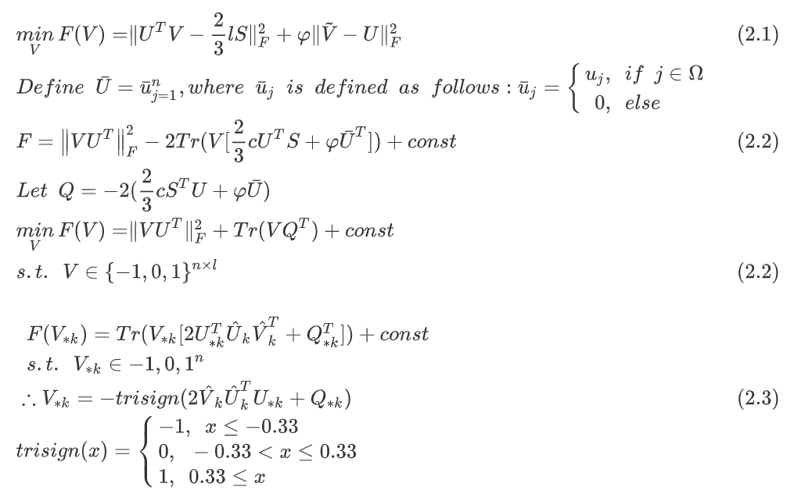
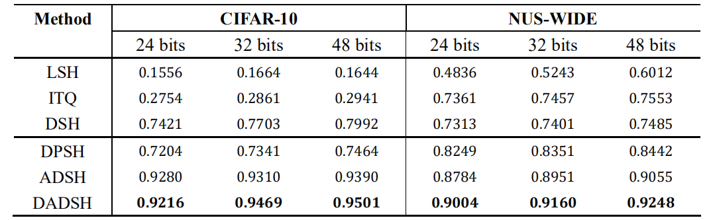

# L2H-Deep Hashing Algorithm for Image Retrieval
### Mark
- [DeepHash - An Open-Source Package for Deep Learning to Hash](https://github.com/thulab/DeepHash)
- [DeepHash - Papers](https://github.com/caoyue10/DeepHash-Papers)

### DADSH
**Objective Function：**

c：类别数，l：编码长度，m、n：样本数

U：网络输出，V：数据集编码

**更新V**

**结果：**

